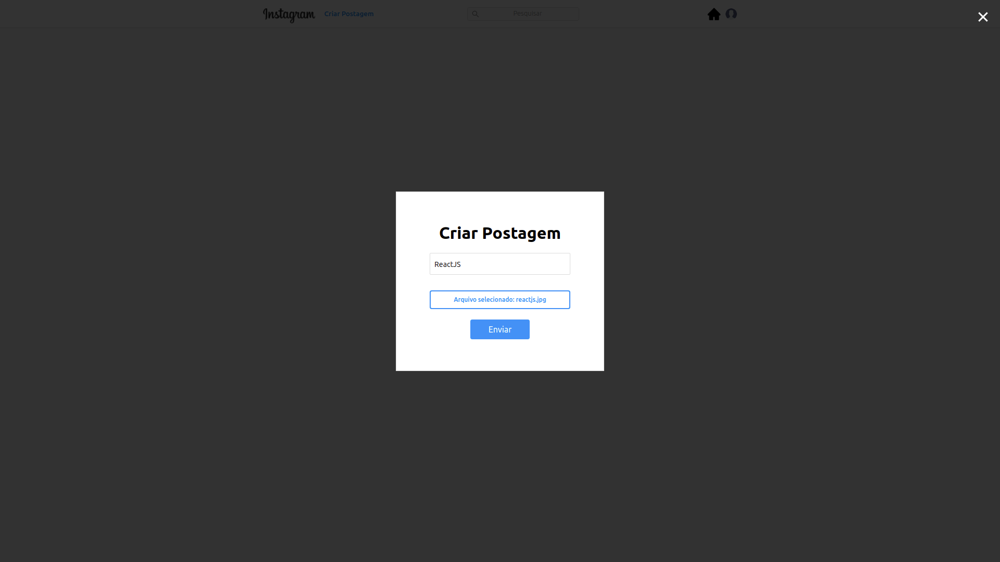
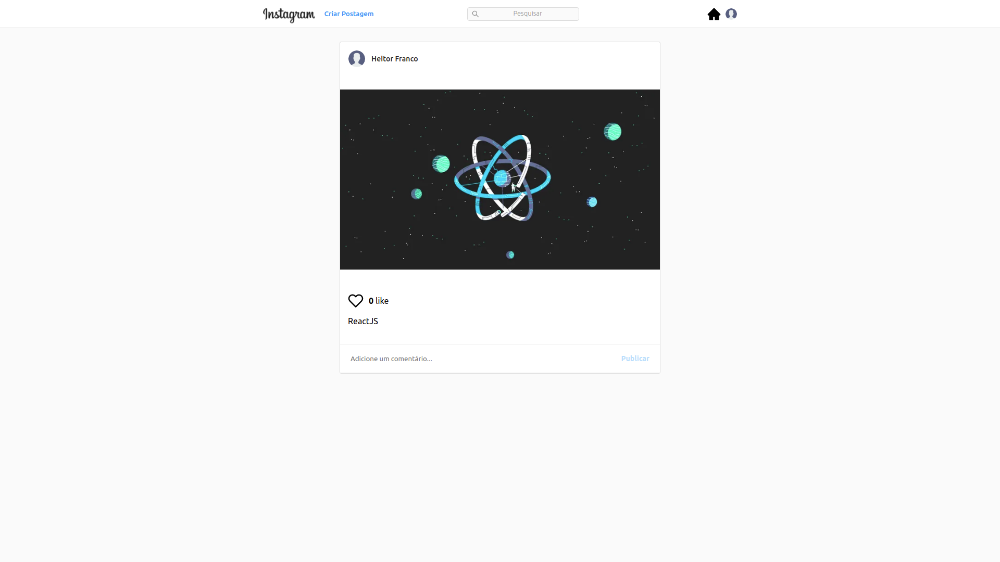
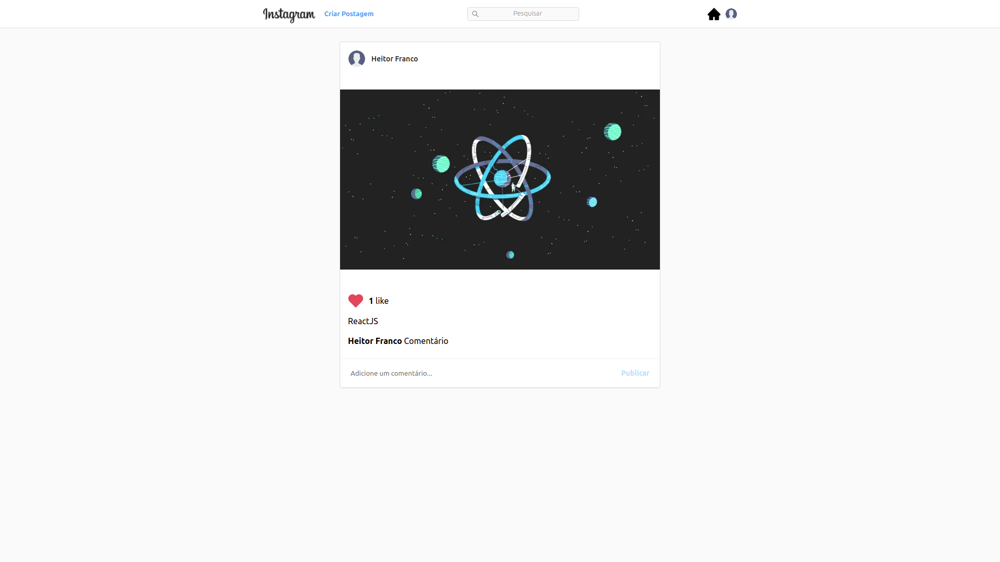

<h1 align="center" style="height: 50px;">
  Clone do Instagram 
</h1>

<p align="center">

</p>
<p align="center">

</p>
<p align="center">

</p>
<p align="center">

</p>

## 🛠 Tecnologias

Esse projeto foi desenvolvido com as seguintes tecnologias:

- [HTML](https://html.com/)
- [CSS](https://developer.mozilla.org/pt-BR/docs/Web/CSS)
- [Typescript](https://www.typescriptlang.org/)
- [ReactJs](https://reactjs.org)
- [Socket.io](https://socket.io/)
- [Styled-Components](https://styled-components.com/)
- [Yup](https://www.npmjs.com/package/yup)

## 💻 Projeto

Esse Projeto é um clone do [Instagram](https://www.instagram.com/). Foi desenvolvido para testar minhas habilidade de programação. Fiquei bem feliz com o resultado, já que a aplicação é totalmente funcional, responsiva e em realtime, ou seja, se você fizer uma postagem, dar o like ou comentar em uma postagem, vai aparecer na tela do outro usuário em tempo real.

## 🛠️ Funcionalidades

- Criar Usuário
- Entrar na conta
- Criar postagem(com imagem)
- Dar like nas postagens
- Enviar comentários nas postagens
- Isso tudo em realtime

## 🚀 Como executar

## Clone o Repositório

```
$ git clone https://github.com/HeitorFranco/CloneInstagramWeb.git

$ cd CloneInstagramWeb
```

## Instalando Dependências

```
$ yarn
```

_or_

```
$ npm install
```

## Executando Aplicação

```
$ yarn start
```

_or_

```
$ npm start
```

**OBS:**

- **É necessário configurar as variaveis de ambiente**
- **Essa aplicação necessita desse [backend](https://github.com/HeitorFranco/api_instagram) rodando**

Agora você pode acessar [`localhost:3000`](http://localhost:3000) do seu navegador.

---

Feito com ❤️ by Heitor Franco
